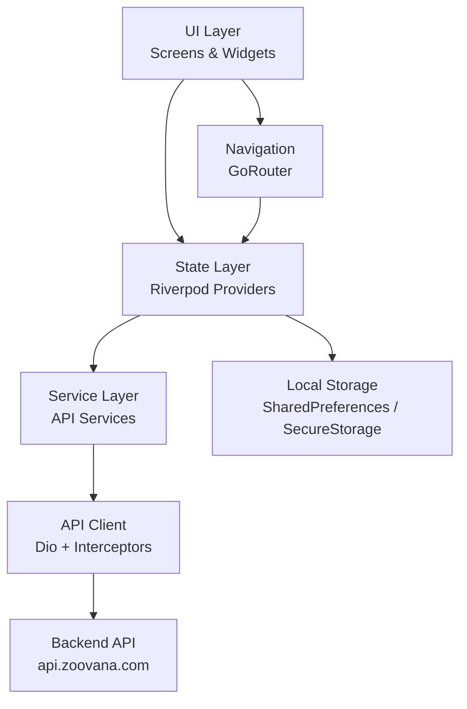

# Design Document: Zoovana App UI

## Overview

Zoovana App UI transforms the existing Flutter skeleton into a production-quality, bilingual (English/Arabic) pet-products marketplace. The design covers the full visual layer — theme system, screen-by-screen component breakdown, navigation, state management, API integration, guest cart, RTL support, skeleton loading, and asset usage — built on top of the existing Riverpod + GoRouter + Dio foundation.

The app targets Saudi Arabia and the wider GCC region, so Arabic RTL support and Saudi phone number validation are first-class concerns throughout.

---

## Architecture

### Layer Diagram



### Key Architectural Decisions

**Riverpod as single source of truth.** All async data (products, categories, cart, orders) lives in Riverpod providers. Screens watch providers and react to `AsyncValue` states (loading → data → error). No local `setState` for server data.

**GoRouter with redirect guards.** Protected routes (`/cart`, `/profile`, `/checkout`, `/orders`) use a `redirect` callback that reads `authStateProvider` and redirects to `/login` when unauthenticated.

**Dio interceptor chain.** `AuthInterceptor` attaches Bearer tokens and handles 401 → refresh → retry. `ErrorInterceptor` normalizes Dio errors into typed app exceptions.

**Guest cart via SharedPreferences.** Unauthenticated cart state is stored locally under `zoovana_guest_cart`. On login, `CartSyncService` merges guest items into the server cart via `POST /cart/sync`.

**Locale provider.** A `localeProvider` (`StateProvider<Locale>`) drives the `MaterialApp.locale`. The active locale is persisted in SharedPreferences and restored at startup. When `ar` is active, `Directionality` is RTL throughout.

---

## Components and Interfaces

### Theme System (`lib/app/core/theme/`)

**`app_colors.dart`** — static color constants:
- `primary`: `Color(0xFF1B6B4A)` (deep teal-green)
- `accent`: `Color(0xFFF5A623)` (warm amber — CTA and sale badge)
- `surface`: `Color(0xFFFAFAFA)`
- `onSurface`: `Color(0xFF1A1A1A)`
- `muted`: `Color(0xFF9E9E9E)`
- `error`: `Color(0xFFD32F2F)`
- `skeletonBase`: `Color(0xFFE0E0E0)`
- `skeletonHighlight`: `Color(0xFFF5F5F5)`

**`app_spacing.dart`** — spacing token constants (multiples of 4 dp):
`xs=4, sm=8, md=12, base=16, lg=20, xl=24, xxl=32, xxxl=48`

**`app_radius.dart`** — border radius tokens:
`small=8, medium=12, large=20, pill=100`

**`app_theme.dart`** — builds `ThemeData`:
- `ColorScheme.fromSeed` seeded from `AppColors.primary`
- `TextTheme` with Poppins (LTR) / Cairo (RTL) font families
- `CardTheme` with elevation 2, shadow `Colors.black12`, surface `AppColors.surface`
- `ElevatedButtonTheme` using accent color
- `BottomNavigationBarTheme` with primary selected, muted unselected

**`app_text_styles.dart`** — named text style constants:
`display, headline, title, body, label, caption`

### Navigation (`lib/app/routes/`)

**`app_router.dart`** — `GoRouter` instance with:
- Shell route wrapping main tabs (Home, Categories, Search, Cart, Profile) — provides `ScaffoldWithBottomNav`
- Nested routes for product detail, category products, checkout, orders, auth screens
- `redirect` callback reading `authStateProvider` for protected routes
- Custom `pageBuilder` using `CustomTransitionPage` for directional slide transitions

```dart
// Route structure
ShellRoute (ScaffoldWithBottomNav)
  /           → HomeScreen
  /categories → CategoriesScreen
    /categories/:slug → CategoryProductsScreen
  /search     → SearchScreen
  /cart       → CartScreen (protected)
  /profile    → ProfileScreen (protected)
    /profile/orders → OrdersScreen
    /profile/receipts → ReceiptsScreen

// Standalone (no bottom nav)
/login        → LoginScreen
/register     → RegisterScreen
/forgot-password → ForgotPasswordScreen
/product/:id  → ProductDetailScreen
/checkout     → CheckoutScreen (protected)
/orders/:id   → OrderDetailScreen (protected)
/orders/:id/receipts/:rid → ReceiptDetailScreen (protected)
```

**`scaffold_with_bottom_nav.dart`** — shell widget that renders `BottomNavigationBar` and the child route body. Reads `cartItemCountProvider` for the cart badge.

### Shared Widgets (`lib/app/widgets/`)

**`skeleton_loader.dart`** — shimmer widget with three variants:
- `SkeletonLoader.card(width, height)` — for product cards
- `SkeletonLoader.listRow()` — for cart/order rows
- `SkeletonLoader.textBlock(lines)` — for headings/descriptions

Uses `AnimationController` with 1500ms period, `ColorTween` between `skeletonBase` and `skeletonHighlight`.

**`product_card.dart`** — reusable card widget:
- `Hero` tag: `product-image-{id}`
- `CachedNetworkImage` with rounded top corners (`BorderRadius.vertical(top: Radius.circular(AppRadius.medium))`)
- Badge overlay (priority: OOS → Sale → Featured → New)
- Add-to-cart `IconButton` (bottom-right)
- Reads `authStateProvider` to decide guest vs. auth cart

**`breadcrumb_widget.dart`** — horizontal path display using `breadcrumb_pets.png` and `breadcrumb_shape01.png` as decorative elements.

**`whatsapp_fab.dart`** — `FloatingActionButton` using `whatsapp.svg`, opens `https://wa.me/966XXXXXXXXX` via `url_launcher`.

**`error_state.dart`** — inline or full-screen error widget with retry callback.

**`empty_state.dart`** — illustration + message + optional CTA button.

**`quantity_stepper.dart`** — `+`/`-` row with minimum value enforcement (min=1).

**`cached_image.dart`** — thin wrapper around `CachedNetworkImage` with fallback asset support.

### Screen Components

#### Home Screen (`lib/app/modules/home/`)

Widgets:
- `HeroBannerCarousel` — `PageView` with `Timer.periodic(4s)`, dot indicators, `h3_banner_slide01.jpg`, `h3_banner_img01.jpg`, `h3_banner_img02.jpg`
- `CategoryBelt` — horizontal `ListView` of `CategoryTile` widgets using `category_img01-06.png`
- `FeaturedProductsGrid` — `GridView.builder` 2-column, reads `productsProvider`
- `TrustBand` — `Row` of 4 `TrustItem` widgets using `features_icon01-04.svg`
- `SaudiBanner` — `Row` with `saudi_banner_left.png` and `saudi_banner_right.png`
- `HomeAppBar` — custom `SliverAppBar` with `Thetopbar.png` branding image

State: `productsProvider` (FutureProvider), `categoriesProvider` (FutureProvider)

#### Categories Screen (`lib/app/modules/categories/`)

Widgets:
- `CategoryGrid` — `GridView.builder` 2-column, reads `categoriesProvider`
- `CategoryTile` — `CachedImage` with fallback to `category_img0{n}.png`, category name overlay

#### Category Products Screen (`lib/app/modules/categories/`)

Widgets:
- `Breadcrumb` — Home > Category Name
- `FilterSortBar` — sort dropdown (price asc/desc, newest)
- `ProductGrid` — `GridView.builder` 2-column with infinite scroll controller
- Pagination: `ScrollController` triggers next page load when `position.pixels >= maxScrollExtent - 200`

State: `categoryProductsProvider.family(slug)` extended with pagination `StateNotifierProvider`

#### Product Detail Screen (`lib/app/modules/products/`)

Widgets:
- `ProductImageGallery` — `PageView` with dot indicators, `Hero` on first image
- `ProductInfo` — name, price, compare-at, badge
- `QuantityStepper`
- `AddToCartButton` — accent color, calls auth or guest cart
- `RelatedProductsRow` — horizontal `ListView` of `ProductCard`
- `Breadcrumb` — Home > Category > Product Name
- `WhatsAppFab`

State: `productProvider.family(id)` (FutureProvider)

#### Search Screen (`lib/app/modules/search/`)

Widgets:
- `SearchBar` — autofocus `TextField` with debounce (300ms via `Timer`)
- `RecentSearchesList` — shown when query length < 2
- `SearchResultsGrid` — 2-column `ProductCard` grid

State: `searchQueryProvider` (StateProvider<String>), `searchProductsProvider.family(query)` (FutureProvider)

#### Cart Screen (`lib/app/modules/cart/`)

Widgets:
- `CartItemRow` — `CachedImage`, name, price, `QuantityStepper`, remove button
- `AnimatedList` for slide-out removal animation (250ms horizontal slide + height collapse)
- `PromoCodeField` — text field + Apply button
- `CartTotals` — subtotal, discount, shipping, grand total
- `CheckoutButton` — accent color CTA

State: `cartProvider` (StateNotifierProvider<CartNotifier, AsyncValue<Cart>>)

#### Checkout Screen (`lib/app/modules/checkout/`)

Widgets:
- `CheckoutStepper` — 3-step: Address → Payment → Confirmation
- `AddressForm` — name, phone (Saudi validation), street, city, postal code
- `PaymentMethodSelector` — radio list from `/checkout/payment-methods`
- `OrderSummaryPanel` — item count, subtotal, grand total
- `PlaceOrderButton` — loading state disables all inputs

State: `checkoutProvider` (StateNotifierProvider)

#### Orders Screen (`lib/app/modules/orders/`)

Widgets:
- `OrderStatusTabBar` — All, Pending, Processing, Shipped, Delivered, Cancelled
- `OrderCardList` — `ListView` of `OrderCard`

State: `ordersProvider` (FutureProvider), `orderStatusFilterProvider` (StateProvider<String>)

#### Profile Screen (`lib/app/modules/profile/`)

Widgets:
- `ProfileHeader` — avatar, name, email
- `ProfileTabBar` — Orders, Wishlist, Addresses, Settings
- `LanguageToggle` — English / Arabic switch
- `LogoutButton`

State: `profileProvider` (FutureProvider), `localeProvider` (StateProvider<Locale>)

#### Auth Screens (`lib/app/modules/auth/`)

Widgets:
- `LoginScreen` — email, password, login button, forgot password link, register link
- `RegisterScreen` — name, email, phone (Saudi validation), password
- `ForgotPasswordScreen` — email field, send reset link button

State: `authStateProvider` (StateNotifierProvider<AuthNotifier, AuthState>)

---

## Data Models

### Extended Product Model

```dart
class Product {
  final String id;
  final String name;
  final String nameAr;          // Arabic name
  final String description;
  final String descriptionAr;   // Arabic description
  final double price;
  final double? compareAtPrice; // null if no discount
  final String imageUrl;
  final List<String> imageUrls; // gallery images
  final String categoryId;
  final String categorySlug;
  final int stock;
  final bool isActive;
  final bool isFeatured;
  final DateTime createdAt;
}
```

### Extended Category Model

```dart
class Category {
  final String id;
  final String name;
  final String nameAr;
  final String slug;
  final String? imageUrl;       // nullable — fallback to local asset
  final bool isActive;
}
```

### Extended Cart Model

```dart
class Cart {
  final List<CartItem> items;
  final double subtotal;
  final double discount;
  final double shipping;
  final double total;
  final String? promoCode;
}

class CartItem {
  final String id;
  final String productId;
  final String productName;
  final String productNameAr;
  final double price;
  final int quantity;
  final String imageUrl;
  final int stock;
}
```

### Guest Cart Item Model

```dart
class GuestCartItem {
  final String productId;
  final int quantity;
  final DateTime addedAt;

  Map<String, dynamic> toJson() => {
    'product_id': productId,
    'quantity': quantity,
    'added_at': addedAt.toIso8601String(),
  };
}
```

### Order Model

```dart
class Order {
  final String id;
  final DateTime placedAt;
  final String status; // pending | processing | shipped | delivered | cancelled
  final double total;
  final List<SubOrder> subOrders;
}

class SubOrder {
  final String id;
  final String sellerName;
  final List<OrderItem> items;
  final double subtotal;
}
```

### Locale Preference

Stored in SharedPreferences under key `zoovana_locale` as a string (`en` or `ar`).

---

## Correctness Properties

*A property is a characteristic or behavior that should hold true across all valid executions of a system — essentially, a formal statement about what the system should do. Properties serve as the bridge between human-readable specifications and machine-verifiable correctness guarantees.*

### Property 1: Spacing tokens are multiples of 4

*For any* spacing token defined in `AppSpacing`, the value in logical pixels shall be divisible by 4.

**Validates: Requirements 1.4**

---

### Property 2: RTL layout applied for Arabic locale

*For any* widget rendered when the active locale is `ar`, the root `Directionality` shall have `textDirection == TextDirection.rtl`.

**Validates: Requirements 1.6, 20.2**

---

### Property 3: Active tab uses primary color

*For any* tab index in [0, 4], when that tab is the selected index of `BottomNavigationBar`, the tab's icon and label color shall equal `AppColors.primary`.

**Validates: Requirements 2.2**

---

### Property 4: Cart badge reflects item count

*For any* integer n ≥ 1, when the active cart (guest or auth) contains n items, the badge displayed on the Cart tab icon shall show the value n.

**Validates: Requirements 2.5**

---

### Property 5: Bottom nav visibility by route

*For any* route in the main shell set (`/`, `/categories`, `/search`, `/cart`, `/profile`), the `BottomNavigationBar` shall be visible. *For any* route outside the shell (`/product/:id`, `/checkout`, `/login`, `/register`), the `BottomNavigationBar` shall not be present in the widget tree.

**Validates: Requirements 2.6**

---

### Property 6: Hero banner auto-advances

*For any* starting slide index i in [0, slideCount-1], after 4 seconds the active slide index shall be (i + 1) % slideCount.

**Validates: Requirements 3.2**

---

### Property 7: Category tile navigation

*For any* category with slug s, tapping its tile shall trigger navigation to the route `/categories/s`.

**Validates: Requirements 3.5, 4.4**

---

### Property 8: Skeleton loaders shown during loading state

*For any* `AsyncValue` provider in the `loading` state, the corresponding screen section shall render `SkeletonLoader` widgets instead of content widgets.

**Validates: Requirements 3.7, 3.12, 4.3, 5.4, 7.8, 8.4, 9.10, 10.9, 11.4**

---

### Property 9: Skeleton loaders replaced with fade-in on data

*For any* `AsyncValue` transition from `loading` to `data`, the content widget shall appear with a fade-in animation of duration 200 milliseconds.

**Validates: Requirements 18.4**

---

### Property 10: Category grid shows only active categories

*For any* list of categories, the rendered `CategoryGrid` shall contain exactly the categories where `isActive == true`, and no others.

**Validates: Requirements 4.1**

---

### Property 11: Category fallback image for missing remote URL

*For any* category where `imageUrl` is null or empty, the rendered `CategoryTile` shall display a local asset image from `category_img01-06.png` rather than a network image.

**Validates: Requirements 4.2**

---

### Property 12: Product card compare-at price display

*For any* product where `compareAtPrice != null`, the `ProductCard` shall display `compareAtPrice` with `TextDecoration.lineThrough`.

**Validates: Requirements 6.2**

---

### Property 13: Product badge priority

*For any* product, the `ProductCard` shall display exactly one badge following the priority: Out of Stock (stock == 0) > Sale (compareAtPrice != null) > Featured (isFeatured == true) > New (createdAt within 7 days). If none apply, no badge is shown.

**Validates: Requirements 6.3**

---

### Property 14: Add to cart — authenticated path

*For any* product id p and authenticated session, tapping the Add to Cart button on `ProductCard` shall invoke `cartProvider.addToCart(p, 1)`.

**Validates: Requirements 6.5**

---

### Property 15: Add to cart — guest path

*For any* product id p when the user is unauthenticated, tapping the Add to Cart button shall persist an entry with `product_id == p` to SharedPreferences under key `zoovana_guest_cart`.

**Validates: Requirements 6.6, 17.1**

---

### Property 16: Quantity stepper minimum invariant

*For any* `QuantityStepper` with current value q, tapping the decrement button when q == 1 shall leave the value at 1 (no decrement below minimum).

**Validates: Requirements 7.3**

---

### Property 17: Add to cart with selected quantity

*For any* quantity n ≥ 1 selected in `QuantityStepper` on `ProductDetailScreen`, tapping Add to Cart when authenticated shall invoke `cartProvider.addToCart(productId, n)`.

**Validates: Requirements 7.5**

---

### Property 18: Search debounce threshold

*For any* query string with length < 2, the `searchProductsProvider` shall not be invoked. *For any* query string with length ≥ 2, the provider shall be invoked after a 300-millisecond debounce.

**Validates: Requirements 8.2, 8.3**

---

### Property 19: Cart totals completeness

*For any* `Cart` object, the `CartTotals` widget shall display all four values: subtotal, discount, shipping, and grand total.

**Validates: Requirements 9.6**

---

### Property 20: Saudi phone normalization

*For any* string of the form `05XXXXXXXX` (where X is a digit, 8 digits after `05`), the phone normalization function shall produce `+9665XXXXXXXX`.

**Validates: Requirements 10.3**

---

### Property 21: Saudi phone validation rejection

*For any* string that does not match the pattern `^05[0-9]{8}$`, the phone validation function shall return an error (non-null error string).

**Validates: Requirements 10.4**

---

### Property 22: Form inputs disabled during submission

*For any* checkout or auth form in the loading/submitting state, all `TextFormField` and button widgets shall have their `enabled` property set to `false`.

**Validates: Requirements 10.9, 15.9**

---

### Property 23: Order status filter

*For any* status value s in {All, Pending, Processing, Shipped, Delivered, Cancelled}, when the filter is set to s, the displayed order list shall contain only orders where `order.status == s` (or all orders when s == All).

**Validates: Requirements 11.3**

---

### Property 24: Order card navigation

*For any* order id oid, tapping the `OrderCard` shall trigger navigation to `/orders/oid`.

**Validates: Requirements 11.5**

---

### Property 25: Profile header displays user data

*For any* `User` object with name and email, the `ProfileHeader` widget shall display both the name and email strings.

**Validates: Requirements 14.2**

---

### Property 26: Locale toggle applies directionality

*For any* locale toggle action, switching to `ar` shall result in `Directionality.of(context) == TextDirection.rtl`; switching to `en` shall result in `TextDirection.ltr`.

**Validates: Requirements 14.7, 20.2**

---

### Property 27: Auth interceptor attaches Bearer token

*For any* outgoing Dio request when `access_token` is present in `FlutterSecureStorage`, the request `headers['Authorization']` shall equal `'Bearer {access_token}'`.

**Validates: Requirements 16.4**

---

### Property 28: Token refresh on 401

*For any* API response with HTTP status 401, the `AuthInterceptor` shall attempt exactly one token refresh before either retrying the original request (on success) or clearing tokens and redirecting to `/login` (on failure).

**Validates: Requirements 16.2, 16.3**

---

### Property 29: Guest cart JSON schema

*For any* item added to the guest cart, the JSON object stored in SharedPreferences shall contain the fields `product_id` (String), `quantity` (int), and `added_at` (ISO 8601 String).

**Validates: Requirements 17.2**

---

### Property 30: Cart sync triggered on login

*For any* non-empty guest cart at the time of successful login, `POST /cart/sync` shall be called with the guest cart items as the request body.

**Validates: Requirements 17.3**

---

### Property 31: Cart sync deduplication keeps higher quantity

*For any* guest cart G and auth cart A that share one or more `product_id` values, the merged cart produced by `CartSyncService.merge(G, A)` shall contain each shared product with `quantity == max(G.quantity, A.quantity)`.

**Validates: Requirements 17.4**

---

### Property 32: Guest cart cleared after successful sync

*For any* successful `POST /cart/sync` response, the SharedPreferences key `zoovana_guest_cart` shall be absent (null or empty) afterward.

**Validates: Requirements 17.5**

---

### Property 33: Directional slide transition by locale

*For any* GoRouter push navigation when locale is `en`, the page transition shall slide in from the right. When locale is `ar`, the page shall slide in from the left.

**Validates: Requirements 19.2**

---

### Property 34: Localization key completeness

*For any* localization key defined in the `AppLocalizations` ARB files, both the `en` and `ar` translations shall be non-empty strings.

**Validates: Requirements 20.3**

---

### Property 35: Locale persistence round-trip

*For any* locale value l in {Locale('en'), Locale('ar')}, saving l to SharedPreferences and then reading it back shall produce the same locale l.

**Validates: Requirements 20.5**

---

## Error Handling

### API Errors

`ErrorInterceptor` maps Dio exceptions to typed `AppException` subclasses:
- `NetworkException` — no connectivity
- `ServerException(statusCode, message)` — 4xx/5xx responses
- `AuthException` — 401 after failed refresh (triggers logout)
- `TimeoutException` — connect/receive timeout

All screens catch `AppException` via `AsyncValue.error` and display `ErrorState` widget with a retry callback.

### Form Validation

- Saudi phone: validated inline on `onChanged` using regex `^05[0-9]{8}$`
- Email: standard RFC 5322 pattern
- Required fields: validated on submit, inline error shown below each field
- Checkout form: all fields validated before enabling "Place Order" button

### Cart Sync Failure

If `POST /cart/sync` fails, the guest cart is retained in SharedPreferences and a non-blocking `SnackBar` is shown: "Could not sync your cart. Items saved locally."

### Token Refresh Failure

`AuthInterceptor.onError` catches refresh failures, calls `secureStorage.deleteAll()`, updates `authStateProvider` to unauthenticated, and uses GoRouter's `refresh` mechanism to trigger a redirect to `/login`.

---

## Testing Strategy

### Unit Tests

Focus on pure logic:
- `CartSyncService.merge()` — deduplication logic (Property 31)
- `PhoneValidator.normalize()` and `PhoneValidator.validate()` — Saudi phone logic (Properties 20, 21)
- `ProductBadge.resolve()` — badge priority logic (Property 13)
- `AppSpacing` token values — divisibility by 4 (Property 1)
- `GuestCartItem.toJson()` / `fromJson()` — JSON schema (Property 29)

### Widget Tests

Focus on UI behavior with mocked providers:
- `SkeletonLoader` variants render without error
- `ProductCard` displays correct badge, compare-at price, disabled state for OOS
- `QuantityStepper` enforces minimum of 1
- `CartTotals` displays all four values
- `BottomNavigationBar` visibility per route
- `ProfileHeader` displays user name and email
- Auth screens disable inputs during loading state

### Property-Based Tests

Using `package:test` with custom generators (or `dart_test` with property helpers):

Each property test runs a minimum of **100 iterations**.

Tag format: `// Feature: zoovana-app-ui, Property {N}: {property_text}`

Key property tests to implement:
- **Property 1**: Generate spacing token indices, assert value % 4 == 0
- **Property 13**: Generate `Product` with random stock/compareAtPrice/isFeatured/createdAt, assert badge priority
- **Property 20 & 21**: Generate valid/invalid Saudi phone strings, assert normalization and validation
- **Property 31**: Generate overlapping guest and auth carts, assert merged quantities
- **Property 34**: For each ARB key, assert both locales have non-empty translations
- **Property 35**: Generate locale values, save/restore, assert round-trip

### Integration Tests

- Auth flow: login → token stored → protected route accessible
- Cart sync: add guest items → login → verify sync called → guest cart cleared
- Token refresh: mock 401 → verify refresh called → original request retried
- Checkout: fill form → place order → verify navigation to confirmation

### Recommended PBT Library

Use `package:fast_check` (Dart port of fast-check) or implement generators with `dart:math` `Random` and `package:test`. Configure each property test with `iterations: 100`.

---

## Asset Usage Mapping

| Asset | Used In | Purpose |
|---|---|---|
| `Thetopbar.png` | `HomeAppBar` | Branding image in the home screen app bar |
| `breadcrumb_pets.png` | `BreadcrumbWidget` | Decorative paw icon in breadcrumb trail |
| `breadcrumb_shape01.png` | `BreadcrumbWidget` | Decorative shape separator in breadcrumb |
| `category_img01.png` | `CategoryTile` (index 0) | Fallback image for first category |
| `category_img02.png` | `CategoryTile` (index 1) | Fallback image for second category |
| `category_img03.png` | `CategoryTile` (index 2) | Fallback image for third category |
| `category_img04.png` | `CategoryTile` (index 3) | Fallback image for fourth category |
| `category_img05.png` | `CategoryTile` (index 4) | Fallback image for fifth category |
| `category_img06.png` | `CategoryTile` (index 5) | Fallback image for sixth category |
| `features_icon01.svg` | `TrustBand` (item 0) | Trust/feature icon — e.g. Free Delivery |
| `features_icon02.svg` | `TrustBand` (item 1) | Trust/feature icon — e.g. Secure Payment |
| `features_icon03.svg` | `TrustBand` (item 2) | Trust/feature icon — e.g. Quality Guarantee |
| `features_icon04.svg` | `TrustBand` (item 3) | Trust/feature icon — e.g. 24/7 Support |
| `h3_banner_slide01.jpg` | `HeroBannerCarousel` (slide 0) | First hero banner slide |
| `h3_banner_img01.jpg` | `HeroBannerCarousel` (slide 1) | Second hero banner slide |
| `h3_banner_img02.jpg` | `HeroBannerCarousel` (slide 2) | Third hero banner slide |
| `products_shape01.png` | `FeaturedProductsSection` | Decorative background shape behind section title |
| `right_arrow.svg` | `CategoryTile`, `BreadcrumbWidget` | Directional arrow — mirrored in RTL via `Transform.scale(scaleX: -1)` |
| `sale.svg` | `SaleBadge` on `ProductCard` | Sale badge icon overlay |
| `saudi_banner_left.png` | `SaudiBanner` | Left panel of Saudi promotional banner |
| `saudi_banner_right.png` | `SaudiBanner` | Right panel of Saudi promotional banner |
| `title_shape.svg` | Section title decorators | Underline/accent shape beneath section headings |
| `whatsapp.svg` | `WhatsAppFab` | WhatsApp floating action button icon |

All assets are registered in `pubspec.yaml` under `flutter.assets` with the `assests/` prefix (note: the folder is named `assests` not `assets`).

---

## Bilingual and RTL Support Design

### Locale Provider

```dart
// lib/providers/locale_provider.dart
final localeProvider = StateNotifierProvider<LocaleNotifier, Locale>((ref) {
  return LocaleNotifier();
});

class LocaleNotifier extends StateNotifier<Locale> {
  LocaleNotifier() : super(const Locale('en')) {
    _restore();
  }

  Future<void> _restore() async {
    final prefs = await SharedPreferences.getInstance();
    final code = prefs.getString('zoovana_locale') ?? 'en';
    state = Locale(code);
  }

  Future<void> setLocale(Locale locale) async {
    final prefs = await SharedPreferences.getInstance();
    await prefs.setString('zoovana_locale', locale.languageCode);
    state = locale;
  }
}
```

### MaterialApp Integration

`MaterialApp.router` reads `localeProvider` and passes it as `locale`. The `Directionality` widget is automatically applied by Flutter's `MaterialApp` when `locale` is `ar` and `GlobalWidgetsLocalizations.delegate` is registered.

### Directional Icons

All directional icons (`right_arrow.svg`) are wrapped in a `Directionality`-aware widget:

```dart
// Mirrors the icon in RTL
Transform.scale(
  scaleX: Directionality.of(context) == TextDirection.rtl ? -1 : 1,
  child: SvgPicture.asset('assests/right_arrow.svg'),
)
```

### Localization Files

ARB files at `lib/l10n/`:
- `app_en.arb` — English strings
- `app_ar.arb` — Arabic strings

Generated `AppLocalizations` class used throughout the app via `AppLocalizations.of(context)!.someKey`.

### Typography

- LTR (English): Poppins font family
- RTL (Arabic): Cairo font family

`app_theme.dart` selects the font family based on the active locale:

```dart
fontFamily: locale.languageCode == 'ar' ? 'Cairo' : 'Poppins',
```

---

## Skeleton Loading and Animation Patterns

### Shimmer Implementation

`SkeletonLoader` uses a single `AnimationController` (1500ms, repeat) with a `ColorTween` from `AppColors.skeletonBase` to `AppColors.skeletonHighlight`. The animated color is applied as the `color` of a `Container` with the appropriate shape.

```
SkeletonLoader.card   → rounded rectangle, aspect ratio ~0.75
SkeletonLoader.listRow → full-width rectangle, height 72dp
SkeletonLoader.textBlock(n) → n stacked rectangles of varying widths
```

### Loading → Data Transition

`AsyncValue.when()` is used on all screens. The `data` branch wraps content in `AnimatedSwitcher` with a `FadeTransition` of 200ms duration, ensuring a smooth swap from skeleton to real content.

### Cart Item Removal Animation

`AnimatedList` is used for the cart item list. On removal, the item animates out using a `SizeTransition` (height collapse) combined with a `SlideTransition` (horizontal slide toward the leading edge) over 250ms.

### Page Transitions

`GoRouter` uses `CustomTransitionPage` with a `SlideTransition`:

```dart
CustomTransitionPage(
  transitionsBuilder: (context, animation, _, child) {
    final isRtl = Directionality.of(context) == TextDirection.rtl;
    final begin = isRtl ? const Offset(-1, 0) : const Offset(1, 0);
    return SlideTransition(
      position: Tween(begin: begin, end: Offset.zero).animate(animation),
      child: child,
    );
  },
)
```

### Bottom Nav Tab Indicator

`BottomNavigationBar` uses `type: BottomNavigationBarType.fixed` with `AnimatedContainer` for the active indicator, configured with 150ms `Curves.easeInOut`.

### Hero Transition

`ProductCard` wraps its `CachedImage` in a `Hero` widget with tag `product-image-{id}`. `ProductDetailScreen` uses the same tag on its gallery's first image, enabling the built-in Flutter hero transition.
